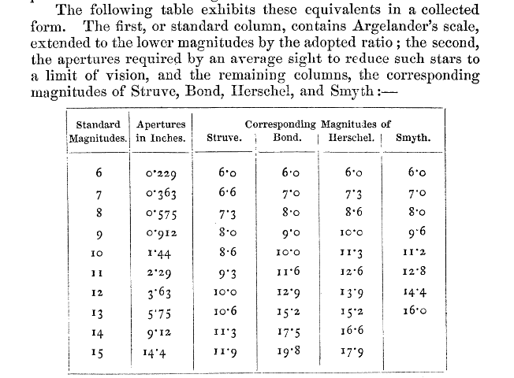
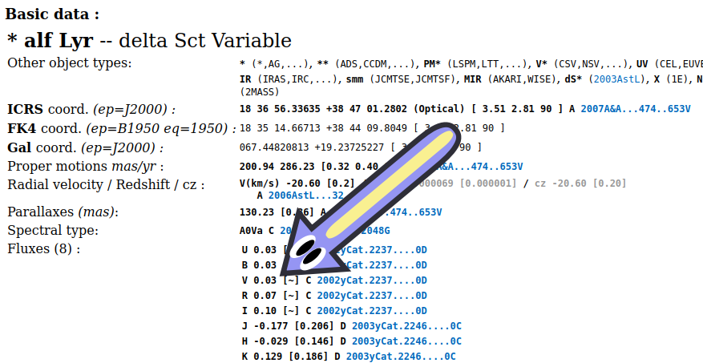

Point at a star. How bright does that star look? 

It sounds like a simple question, but when I tried to understand how we measure star brightness, I discovered a story of decades-old misinformation, rabbit holes of sexism, and at least two standards whose names have stories of their own. 

## The Ancients Mess Everything Up

Our modern star brightness scale is called <i>apparent magnitude</i>, and it's based on a vibes-based system from Ancient Greece that's two thousand years old. Ptolemy's <i>Almagest</i>, the ancient smash hit physics book that convinced the world the sun went around the earth for a thousand years or so, had a star catalog that sorted stars into six categories: "first magnitude" stars were the brightest, and "sixth magnitude" stars were the dimmest. While some stars were described as "above" or "below", to the <i>Almagest</i> magnitude meant one of several discrete categories and not a continuous scale.

<aside>(Fun fact: The <i>Almagest</i> catalog mistook Uranus for a star, and the mistake stuck around [for thousands of years!](https://journals.sagepub.com/doi/10.1177/002182861304400401))</aside> 

Thanks to the Greeks, lower magnitude means brighter, and we've been stuck with that ever since. This led to some silly consequences in the modern scale - for example, what do you do if a star is brighter than magnitude 1? Use numbers lower than 1. In the modern apparent magnitude system, Sirius, the brighest star in the sky, is around magnitude -1.5, and a full moon is around magnitude -12.7.

For over a thousand years, many star catalogs copied the <i>Almagest</i>'s magnitudes. One star catalog that didn't was written by 10th century Persian astronomer Al-Sūfī, who used his own observations and deserves credit for attention to detail and cross-checking stars with the same magnitude. Then, in the 1600s, a new invention called the telescope revealed new stars too faint to see by eye. While I suppose telescopes deserve a bit of credit for changing our understanding of the cosmos forever, they also made measuring brightness more complicated. 

Eventually we began to realize that some stars were farther away than others, which meant astronomers needed more precise words to talk about brightness. In everyday language, "bright" can describe a flashlight shining directly into your eye, and "bright" can describe a powerful lighthouse shining from kilometers away. The problem: far away lights look dimmer. Should we call stars bright if our eye sees lots of light, or if they're emitting lots of light? Modern astronomers use two different names for these ideas: <i>apparent magnitude</i> means how bright a star looks to Earth, and <i>absolute magnitude</i> is a calculation of how bright a star would be if viewed from a fixed distance (10 parsecs) away. Absolute magnitude is more useful for star science, but apparent magnitude is what you measure in a telescope, so this story is about apparent magnitude.

Even into the 1800s, magnitudes meant categories to sort stars into. Galileo was the first to suggest a "seventh magnitude" category for stars fainter than the sixth, but it took a few hundred years before John Flamsteed published the first star catalog with a seventh magnitude. By the 1850s William Herschel's catalogs went down to twelth magnitude. Everyone agreed with Ancient Greece on the brightest stars' magnitudes, but unfortunately different catalogs had different magnitude scales for those new dimmer stars, so the same star might be twelth magnitude in one catalog and tenth magnitude in another.

In 1856 Norman Pogson, an assistant in the Radcliffe Observatory, tried to formalize magnitudes by [defining a logarithmic scale where a magnitude 6 star is 1/100th as bright as a magnitude 1 star](https://doi.org/10.1093/mnras/17.1.12). I couldn't find much info about Pogson, but he moved to India to be director of the Madras observatory and discovered a few asteroids, [one of which his boss named after his daughter Isis Pogson](https://en.wikipedia.org/wiki/42_Isis). 

<aside>(Fun fact about Isis Pogson: She became the first female astronomer to be nominated as a British Royal Astronomical Society Fellow, but the society decided she wasn't eligible because its constitution only used "he". She got in 34 years later.)</aside>

Pogson's relative magnitude scale was popularized by the 1884 <i>Harvard Photometry</i> star catalog, which says that it used the scale because "the computation is simple". In two years, two more large-scale sky catalogs were released, including the more accurate <i>Potsdamer Duchmusterung</i> catalog, and both used Pogson's scale. From then on, Pogson's scale became the de facto standard. Modern astronomy still uses his ratio of +5 magnitudes = 1/100 the brightness to define magnitude differences today! 

Using this scale, a magnitude 6 star is exactly 1/100 the brightness of a magnitude 1 star, and 100 times as bright as a magnitude 11 star. Magnitudes weren't just a finite list of categories anymore, but instead continuous numbers.

How bright is a magnitude 2 star, compared to a magnitude 1 star, on this scale? If a +1 magnitude difference means dividing a magnitude 1 star's brightness by x, then a +1+1+1+1+1=+5 magnitude difference means multiplying by x\*x\*x\*x\*x. Since a difference of +5 magnitudes means dividing brightness by 100, we can solve x5 = 100 to get x = 1001/5 ≈ 2.51. So a magnitude 1 star is around 2.51 times brighter than a magnitude 2 star, and 2.51 * 2.51 times as bright as a magnitude 3 star.

## Pogson's reference point

However: how do we measure magnitude zero?

Pogson's scale technically only defines magnitude differences between two stars. That's because Pogson worked with a telescope designed to compare two stars' brightnesses by using two eyepieces and shrinking the telescope aperture to let in less and less light until one star disappeared. If we measure that one star is 2 magnitudes fainter than another star, all we know is that the two stars have magnitudes x and x+2. To give a star a magnitude number, we need to compare its magnitude to at least one thing that we know the magnitude of. Once we define the brightness of, say, magnitude zero, then Pogson's rule lets us define magnitude one, two, three, and all the others. That means before we can use Pogson's scale, we need a reference point: we need to choose one thing and give it a specific magnitude to compare everything else to.

According to the Wikipedia page for <i>Apparent Magnitude</i>, Pogson decided the star Polaris, visible from the entire northern hemisphere, would be the reference point for magnitude 2! And all was well in the world.

</img>

**🚨BREAKING NEWS🚨**

What?

...Ahem. We regret to inform you that actually, Pogson didn't use Polaris to calibrate his scale. Wikipedia is wrong, and [has been wrong for over 22 years](https://en.wikipedia.org/w/index.php?title=Apparent_magnitude&diff=prev&oldid=235741).

How did Pogson calibrate his scale? I tracked down [Pogson's original 1857 paper, <i>Magnitudes of Thirty-six of the Minor Planets for the First Day of each Month of the Year</i>](https://doi.org/10.1093/mnras/17.1.12). There, Pogson says he based his work on magnitudes "taken from the Radcliffe Observations, from the zones of Argelander and Bessel, and from the star catalogues of Piazzi, Lalande, and Groombridge". No Polaris. Later, that paper makes a formula for the faintest magnitude you can see through a given aperture, and calculates that the dimmest star a human eye (with an 0.23" pupil) can see should be magnitude 6.0 on Argelander's scale. Then, he uses Argelander's magnitude 6.0 and the familiar ratio +5 magnitude = 1/100 brightness to define what he called "standard magnitudes":

</img>

So Pogson never defined his scale using Polaris. In reality, Pogson actually calibrated his scale using the idea that magnitude 6.0 is around the faintest the naked eye can see, which many star catalogs agreed on at the time.

 

Where did this anonymous Wikipedia editor get the false idea that Pogson defined the scale using "Polaris = Magnitude 2.0"? There's no way to know for sure, but I have a theory. At first I thought maybe the anonymous wikipedia user was confusing this with the <i>North Polar Sequence</i> (also known as the Standard Polar Stars or North Polar Standards), a table of high-quality star magnitude measurements compiled by Harvard astronomer Henrietta Leavitt, which was published over 50 years after Pogson's magnitude paper. She was a legendary figure who developed a technique for measuring distances to variable stars, which helped us measure the distance to other galaxies.

Then, in J.B. Hearnshaw's book <i>The Measurement of Starlight</i>, I saw something. Remember how the <i>Harvard Photometry</i> star catalog popularized Pogson's scale? That star catalog did use "Polaris = Magnitude 2.0" in the early years! But even if we give the credit for that choice to the director of the Harvard Observatory, Edward Charles Pickering, he's not Pogson. In fact, within a year the <i>Harvard Photometry</i> catalog switched to "Polaris = Magnitude 2.15" to better agree with Argelander, then eventually "Polaris = 2.12". In practice, the Harvard catalogers used 100 stars around fifth magnitude close to Polaris to define a zero point. Pogson never used "Polaris = Magnitude 2.0", and Wikipedia is still wrong.

**🚨BREAKING NEWS🚨**

What?

...Ahem. We regret to inform you that modern measurements show Polaris is actually 3 stars in a trenchcoat, and the biggest one changes brightness in a 4-day cycle. The Harvard folks hadn't realized Polaris was a variable star. Good thing we don't use Polaris as a standard.

## The Johnson UBV system (1953)

After Polaris, according to Wikipedia, we decided the star Vega will be the reference point! In 1953, Harold Johnson and William Morgan published a paper defining a new system called <i>UBV</i> for measuring magnitude in 3 ways, using filters that let through only ultraviolet (U), blue (B), or visible (V) wavelengths of light. 

The idea of multiple types of magnitudes for different types of light wasn't new - in fact, Johnson even cites <a href="https://articles.adsabs.harvard.edu/pdf/1943ApJ....98...20S">Joel Stebbins and A.E. Whitford</a> who introduced the first UBV system in 1943 - but Johnson's system is still in use today. More importantly: stars emit different light in different wavelengths, so each magnitude type uses a different zero point. Each filter's zero point, according to Wikipedia, is simply however bright Vega is in that filter. And so this magnitude system is called <i>Vega normalized</i> to this day, and all was well in the world.

**🚨BREAKING NEWS🚨**

What? 

...Ahem. We regret to inform you that the Vega normalized system isn't normalized to Vega. In Johnson's UVB system, Vega's magnitude isn't 0 in U, or B, or V. As the SIMBAD star database [shows](https://simbad.cds.unistra.fr/simbad/sim-basic?Ident=vega&submit=SIMBAD+search), Vega has magnitude 0.03:

</img>

What?! Astronomers, why<sm>y<sm>y<sm>y<sm>y<sm>y<sm>y<sm>y<sm>y<sm>y<sm>y<sm>y<sm>y<sm>y<sm>y<sm>y</sm></sm></sm></sm></sm></sm></sm></sm></sm></sm></sm></sm></sm></sm></sm>

Turns out, Wikipedia was wrong again. I tracked down Johnson's [original 1953 paper](https://ui.adsabs.harvard.edu/abs/1953ApJ...117..313J/abstract), and Johnson didn't choose "however bright Vega is" to be zero magnitude, he chose "the average brightness of Vega and five other stars similar to Vega". Here, look at the original paper: (α Lyr is another name for Vega)

</img>

Why the confusion? I have a theory. Different stars are hotter or cooler, which can tell us how old a star is, so astronomers like measuring star temperatures. Like red-hot flames versus blue-hot flames, stars at different temperatures give off different colors of light. One common way to estimate a star's temperature by measuring a star's B and V magnitudes and subtracting them, to get a number called <i>B-V</i>, or the <i>color index</i>. [(We knew this technique as far back as 1916!)](https://www.pnas.org/doi/10.1073/pnas.3.1.29) Vega and the other 5 stars were probably all chosen because they're the same type of star, with the same spectrum, so they have the same color index. Therefore, the Johnson system defines Vega to have zero **color index**, not zero magnitude. Maybe somewhere along the way the two ideas got confused.

So Vega is magnitude 0.03 in V because it just so happens to be 0.03 magnitudes dimmer in V than the six-star average reference point, and because Vega's B-V and U-B must be zero by definition, Vega is also magnitude 0.03 in U and 0.03 in B. If we want to measure brightness in any other wavelength, we declare magnitude 0 is "the average brightness of those six stars in that wavelength". 

And that's how we measure brightness, and all was well in the world.

**🚨BREAKING NEWS🚨**

What?

...Ahem. We regret to inform you that modern measurements show Vega changes brightness by 1-2% in a 21-year cycle. It's really cool that we can detect that, but we probably shouldn't use Vega as a standard to compare all other stars to.

# The Cousins system

As technology evolved, we started trying to measure brightness in other wavelengths of light, including infrared. Our eyes can't see infrared light, but our skin feels it as heat. Infrared light is hard to measure because anything in room temperature glows with infrared light - similar to how red-hot metal glows red, anything at room temperature glows infrared. However, infrared measurements are very valuable to astronomers because space dust and dim stars glow strongly in infrared light - and so do faraway galaxies whose light has been redshifted.

Eventually Johnson extended his UBV system to include two more wavelengths and filters, named R (red) and I (infrared), but his RI measurements weren't very precise. Once better gallium arsenide detectors were invented a few years later, Alan Cousins installed slightly different R and I filters in an observatory in South Africa along with a more sensitive detector, and published incredibly precise measurements of star magnitudes. Nowadays the <i>Johnson-Cousins system</i> or <i>UVBRI system</i> usually means Johnson's U, V, B filters and Cousins' tweaked R and I filters.

But where to set the zero points for R and I? [As Cousins says](https://articles.adsabs.harvard.edu/pdf/1976MmRAS..81...25C), he decided to follow Johnson's lead and set the zeroes so that the two color indices (V-R) and (R-I) are zero for a star of the same spectral type as Vega (which is A0 V). Makes sense. We know a lot about Vega. ["Vega is the archetypical normal star"](https://articles.adsabs.harvard.edu/pdf/1979SAOSR.387.....K), wrote one paper.

**🚨BREAKING NEWS🚨**

...What?

...Ahem. We regret to inform you that Vega [has a non-archetypical and abnormal disk of cold dust around it that gives off extra infrared light](https://articles.adsabs.harvard.edu/pdf/1984ApJ...278L..23A), making it seem brighter in mid-infrared wavelengths than it actually is. In 100μm infrared light, the dust is 16 times brighter than Vega. Oops. We probably shouldn't have used Vega to calibrate our R and I magnitude systems.

# Every Filter Has Its Own Magnitude System

Eventually, astronomers invented even more filters to capture different types of light. More filters meant more types of magnitudes! Some historical systems that didn't catch on but make fun acronyms include Jan Borgman's RQPNMLK, the Walraven WULBV, and Vytautas Straižys's Vilnius system UPXYZVS. For infrared in particular, there are many types of infrared light - and since Johnson already used the letter I for a filter, when new filters were needed to capture different types of infrared light, astronomers decided to use the letters after I. Nowadays we've standardized on an alphabet soup of filters named UBVRIJHKLMN, each letter referring to a different filter - and H doesn't even come after J! Some telescopes have their own filters named rgb after red, green, and blue. The lowercase is mandatory. Z and Y are filters, but W and X aren't. Each of those filters needs its own reference point for magnitude zero.

The Hubble telescope and JWST have filters named with a different pattern - F230M is a "M"edium-width Filter centered around light with a wavelength of 2.30 microns. Thank you, NASA, for freeing us from the tyranny of single-letter filter names.

# Just Measure Energy: The AB system

At this point, the stars are too imprecise for us to measure the stars with.

So we decided math will be the reference point! It's 1983. [New system: the <i>AB magnitude</i> system!](https://ui.adsabs.harvard.edu/abs/1983ApJ...266..713O/abstract) Instead of measuring magnitude using brightness in a specific filter like UBV, this system measures the amount of energy in exactly one wavelength at a time. Finally, the zero point for all wavelengths is defined as exactly 10(48.60÷−2.5 + 23) = 3631 Janskys, a number chosen so Vega will still have magnitude 0.03 in V. And we'll call it the AB system.

...what does AB stand for? Absolute Brightness? ABsolute?"

I really hope AB doesn't stand for ABsolute. It would be pretty confusing if an AB magnitude meant <i>apparent absolute magnitude</i> when <i>absolute magnitude</i> already means something.

Let me check the paper... hmmm... it... doesn't actually say what AB stands for. [The 1983 paper defining the AB system](https://articles.adsabs.harvard.edu/pdf/1983ApJ...266..713O) calls their Vega measurements "AB79" and cites AB69. I think AB69 means measurements from a 1970 paper by J.B.Oke and R.E. Schild titled <i>The absolute spectral energy distribution of alpha lyrae</i> where they describe how in 1969 the astronomers heated up pure platinum and copper until it melted so they could compare the red-hot glow to Vega's light, and reported Vega's spectrum. Badass... but the 1970 paper doesn't actually use the acronym AB anywhere. The world will never know what AB stands for.

Sadly, J.B.Oke died in 2004. R.E. Schild nowadays [runs a blog where he complains black holes aren't real](https://thejournalofcosmology.com/indexVol25CONTENTS.htm).

There's a slight problem: an AB magnitude is a theoretical ideal that's subtly impossible to measure. An AB magnitude is supposed to measure energy from exactly one wavelength of light. [This paper](https://browse.arxiv.org/pdf/2206.00989.pdf) notes that in reality, it's impossible for a filter to block out all but one wavelength of light because of how waves work. Even filters on the most cutting edge space telescope we have, such as the ultra-narrow F164N filter on JWST, is designed to measure light at 1.644 µm but allows light anywhere from 1.654 µm to 1.634µm. Any filter will let through a range of wavelengths, and different wavelengths carry different amounts of energy. Replacing a filter with one that lets through a narrower range will give you a better AB magnitude estimate, but it'll also mean blocking more light, so the detector will detect less total energy - which could make you think the star is dimmer.

Even worse, different wavelengths having different energies means the type of detector a telescope uses matters. Some types of telescope sensors add up the total energy from those different-energy photons, while other sensors use the photoelectric effect to count the number of photons from space, unable to measure each one's exact wavelength. To compute the AB magnitude, which relies on energy, photon-counting detectors must then multiply the number of photons they got by the energy per photon they were expecting - but that means assuming every photon carries the same energy, when they don't. Different detectors will give slightly different AB magnitude measurements even if observing the same star using the exact same filter. Annoying! 

 

So that's how we measure brightness. Finally, I can go outside and look for some bright, low-magnitude objects in the sky.

**🚨BREAKING NEWS🚨**

...What?

...Ahem. We regret to inform you that the Andromeda galaxy is magnitude 3.44 in V, which should be brighter than the star Alcor (magnitude 4.01 in V). But Alcor is clearly brighter to the eye than the Andromeda galaxy. What?

# Magnitude was NEVER the right tool for brightness

I talked to a real astronomer. Turns out, magnitude doesn't even measure brightness - it measures total energy. Specifically, measuring something's AB magnitude involves adding up the total energy per second from that thing's entire surface area. That means big but faint objects could have the same magnitude as small but bright objects. Our eye gets a high amount of total light energy from the Andromeda galaxy, but that energy is spread out along a faint but big area. In practice, this also means objects that aren't points of light (like galaxies and nebulae) look dimmer in a telescope if you zoom in, because that makes them look bigger. For these non-point objects (which astronomers call <i>extended objects</i>), the right way to measure brightness is to abandon magnitude and measure the <i>radiant flux</i>, which includes units of surface area. If you want to go even further, you can convert your radiant flux into <i>luminous flux</i>, which accounts for how the eye can see some wavelengths of light better than others.

Even worse, if you're being very precise, a star's apparent magnitude changes throughout a night depending on how high it is in the sky, because you have to see that star through more or less atmosphere. Earth's atmosphere blocks some wavelengths of light worse than others, which means star colors change throughout a night!

Also, the quest for a reference star which would be a constant brightness was doomed from the start. Our modern equipment is so sensitive that we can see almost every star changing brightness over time because of things like sunspots and oscillations. Oops. 

However, magnitudes are still useful for (1) taking photos of many many stars at once, and (2) comparing brightness between stars. In fact, brightness comparisons are exactly what we want when studying exoplanets, where we don't care about absolute brightness, just how much the brightness drops when a planet blocks some of the starlight. Magnitudes are also great shorthand for talking about brightness imprecisely, since saying "only 50 Janskys" doesn't exactly tell you how faint something is.

 

And that's how we measure brightness. Apparent magnitude isn't applicable everywhere, but it has accomplished an impressive goal: two thousand year old observations are still compatible with the modern magnitude system. All the ideas and terms we invented along the way, from apparent magnitude to absolute magnitude to radiant flux to luminous flux to wavelengths to Janskys, were needed because measuring is hard and light is complicated. The numbers may be just simple logarithms, but we should appreciate just how much effort goes into calibrating the scales, understanding the subtle nuances of definitions, knowing what a measurement doesn't capture, and fighting the messiness of the universe. That connection to the past, deliberately making sure our old observations fit into newly created measuring scales, is something sweet and worth celebrating.

Thanks, astronomers, for fighting the good fight. Whatever crazy-advanced detectors we come up with in the future, I'll rest easy knowing future generations will spend years double and triple-checking their measurements to ensure their Vega-normalized systems will normalize Vega to precisely magnitude zero... point zero three.

 

Bibliography

Norman Pogson and the Definition of Stellar Magnitude. [https://adsabs.harvard.edu/full/1968ASPL...10..145J](https://adsabs.harvard.edu/full/1968ASPL...10..145J)

Alan MacRobert. The Stellar Magnitude System, 2006, [https://skyandtelescope.org/astronomy-resources/the-stellar-magnitude-system/](https://skyandtelescope.org/astronomy-resources/the-stellar-magnitude-system/)

Pogson, Norman. Magnitudes of Thirty-six of the Minor Planets for the First Day of each Month of the Year, 1857, [https://doi.org/10.1093/mnras/17.1.12](https://doi.org/10.1093/mnras/17.1.12) (Defines Pogson's +5 mag = 1/100 brightness ratio)

The Pan-STARRS1 Photometric System, 2012, [https://arxiv.org/pdf/1203.0297](https://arxiv.org/pdf/1203.0297)

Johnson & Morgan. Fundamental stellar photometry for standards of spectral type on the Revised System of the Yerkes Spectral Atlas, 1953 [https://ui.adsabs.harvard.edu/abs/1953ApJ...117..313J/abstract](https://ui.adsabs.harvard.edu/abs/1953ApJ...117..313J/abstract). (Defines the UBV system)

J.B.Oke and J.E.Gunn. Secondary Standard Stars For Absolute Spectrophotometry, 1983, [https://ui.adsabs.harvard.edu/abs/1983ApJ...266..713O/abstract](https://ui.adsabs.harvard.edu/abs/1983ApJ...266..713O/abstract) . (Defines the AB system)

The long-term variability of Vega [https://doi.org/10.1002/asna.201111587](https://doi.org/10.1002/asna.201111587)

Michael S. Bessel. Standard Photometric Systems, 2005, [https://www.annualreviews.org/doi/full/10.1146/annurev.astro.41.082801.100251](https://www.annualreviews.org/doi/full/10.1146/annurev.astro.41.082801.100251)

Michael S. Evans, Achieving continuity: a story of stellar magnitude, 2009, [https://www.sciencedirect.com/science/article/abs/pii/S0039368109000934](https://www.sciencedirect.com/science/article/abs/pii/S0039368109000934) (Very fun article about stories we tell in science about continuity with the past)

J.B.Hearnshaw, The Measurement of Starlight: Two Centures of Astronomical Photometry (Incredibly detailed book. Amazing resource)

 Cousins, A. W. J. VRI Photometry at the S. A. A. O. [https://ui.adsabs.harvard.edu/abs/1975MNSSA..34R..68C/abstract](https://ui.adsabs.harvard.edu/abs/1975MNSSA..34R..68C/abstract )

Bessell, M. S. UBVRI photometry II: the Cousins VRI system, its temperature and absolute flux calibration, and relevance for two-dimensional photometry. [https://ui.adsabs.harvard.edu/abs/1979PASP...91..589B/abstract](https://ui.adsabs.harvard.edu/abs/1979PASP...91..589B/abstract) (proposed Cousins VRI system)

Stebbins J and Whitford. 1943, A.E. astrophys.J. 98, 20, Six-color photometry of stars. I. The law of space reddening from the colors of O and B stars

H. H. Aumann, F. C. Gillett, C. A. Beichman, T. de Jong, J. R. Houck, F. J. Low,
G. Neugebauer, R. G. Walker, and P. R. Wesselius. Discovery of a Shell around Alpha Lyrae, 1984, [https://articles.adsabs.harvard.edu/pdf/1984ApJ...278L..23A](https://articles.adsabs.harvard.edu/pdf/1984ApJ...278L..23A)

Frank J. Low, G.H. Rieke, and R.D. Gehrz. The Beginning of Modern Infrared Astronomy [https://www.annualreviews.org/content/journals/10.1146/annurev.astro.44.051905.092505](https://www.annualreviews.org/content/journals/10.1146/annurev.astro.44.051905.092505)

